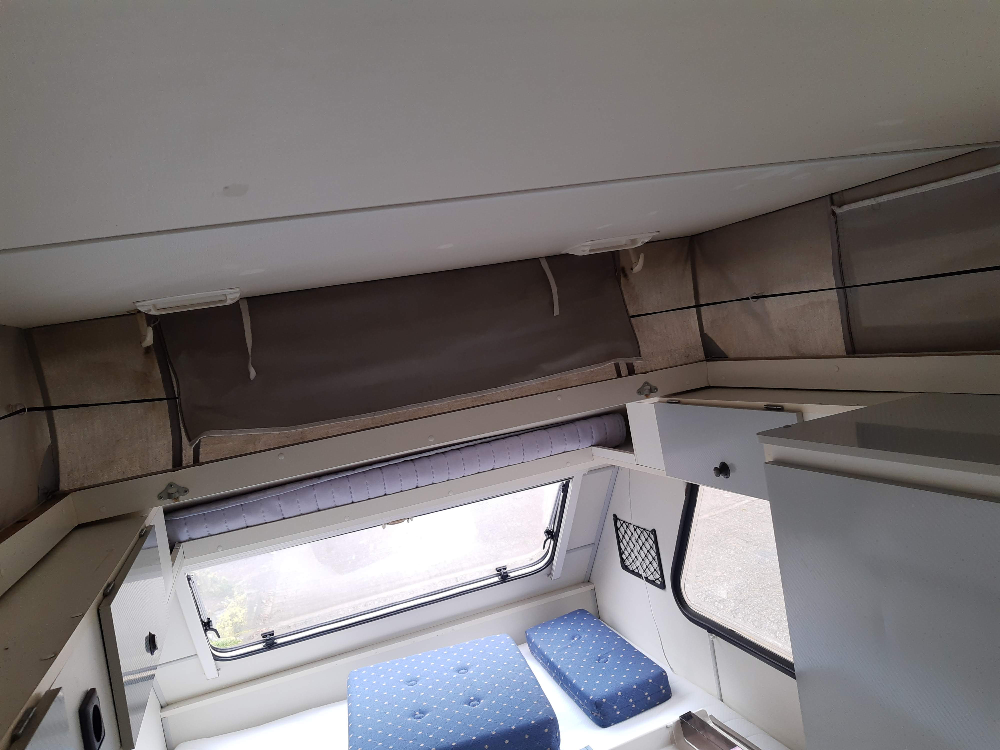
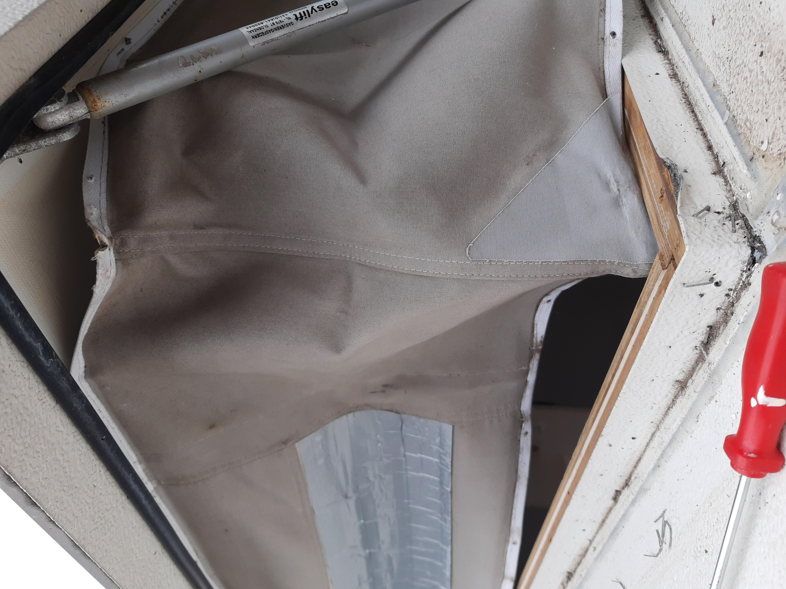
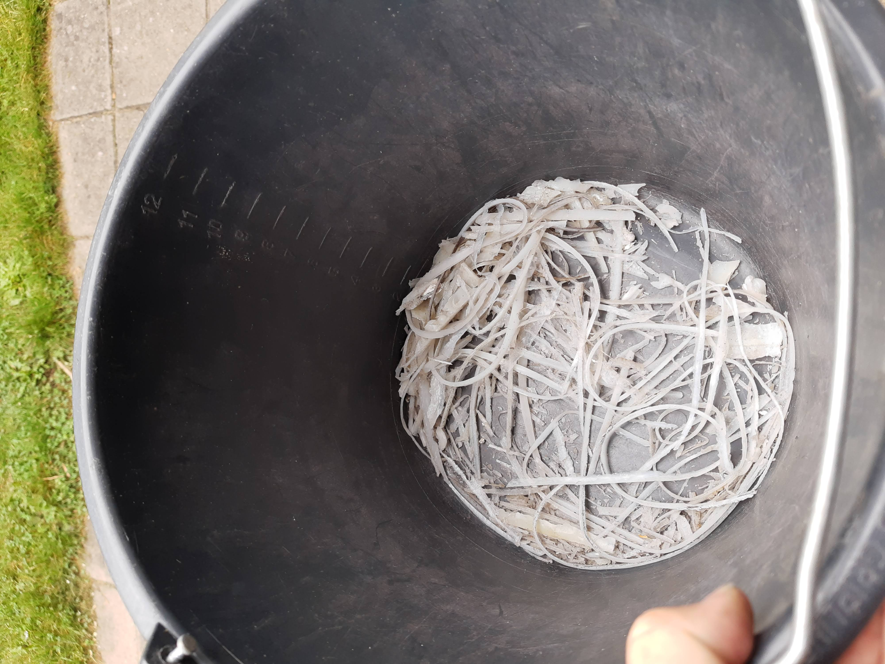
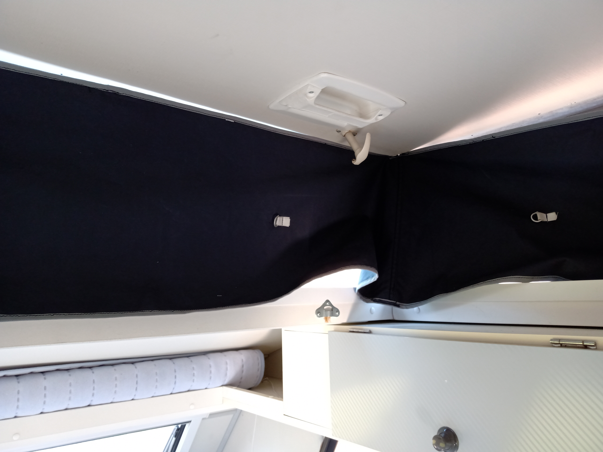
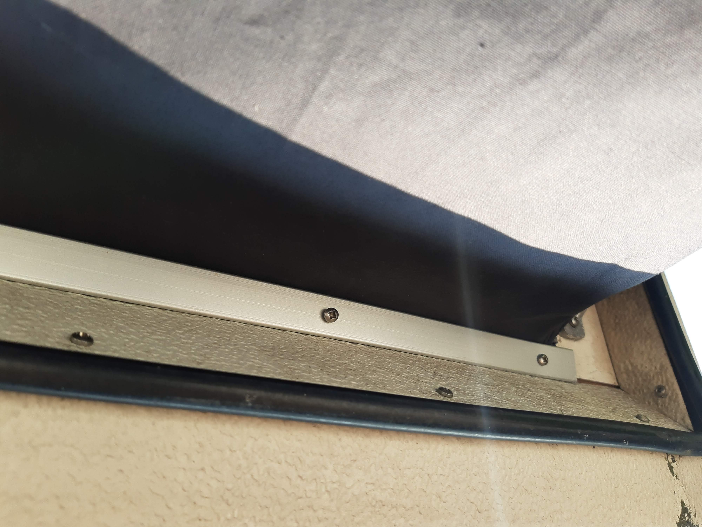
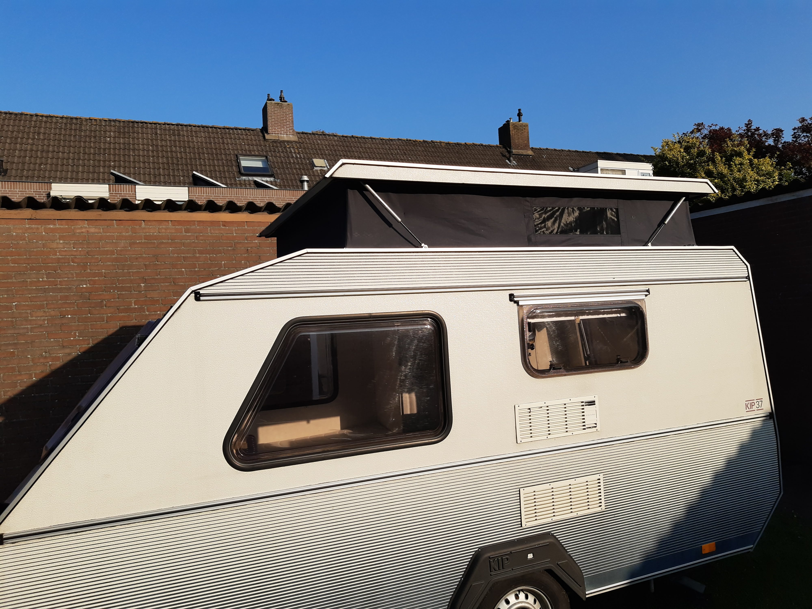

# Kip Kompakt 
## Nieuw hefdak
Onze Kip Caravan heeft een hefdak. Het doek van dit dak is net als de caravan al meer dan 20 jaar oud. Bij de hoeken zitten gaten van het opvouwen, en het doek is niet meer waterafstotend. Na enkele lapmiddelen, zoals opstrijk-doek in de hoeken, en impregneer-spray bleek het dak in een flinke regenbui op meerdere plaatsen door te lekken. 

Ook is het dak door vorige eigenaren met sileconenkit behandeld. Deze kit kan niet goed tegen zonlicht, en heeft ook niet goed gehecht aan het dak.

Kortom: **Tijd om het goed aan te pakken. We gaan het dak verwijderen en na laten maken**. Dat is gelijk een mooi moment om alle kit te verwijderen, en het dak opnieuw in te kitten met [de juiste soort kit](https://www.obelink.nl/dekalin-dekasyl-ms-2-afdichtingskit.html).

### Voor het verwijderen

Zo zag het dak er uit voordat we het hebben verwijderd.

### Verwijderen van het dak

Eerst verwijderen we de inlegbies rondom. Dit is de plastic strip die de  schroeven afdekt. Deze is niet opnieuw te gebruiken omdat het plastic uitgehard is. 

Daarna verwijderen we de schroeven uit het aluminium profiel
 

Als alle schroeven los zijn kunnen de aluminium afwerkstrips verwijderd  worden. Aan de bovenkant zitten eenvoudige aluminium strips geschroefd, die verwijderen we ook.

Het doek zit vast aan de caravan met 100'en nietjes

Dan is het tijd om de nietjes te verwijderen. Dit gaat prima door ze eerst met een dunne schroevendraaier omhoog te duwen, en met een tang er uit te trekken. 

We hebben tijdens het losmaken met touwtjes het dak weer vastgezet, om te  voorkomen dat de gasveren het dak wegduwen.

Het is nu een erg luchtige caravan geworden.

### Schoonmaken dak
Tijd om de kit te verwijderen. Eerst snijden en krabben we de grove stukken weg.

De aluminium strips en profielen zijn ook schookgekrabd (en worden goed bewaakt).

Op de plaats waar de dakplaten overlappen is ooit een dik aluminium plaatje geplaatst. Dit zorgt voor een soort zwembadje op het dak, omdat het water niet weg kan stromen. We gaan dit vervangen door grotere platte aluminium platen over de hele lengte dan het dak.

Ondertussen hebben we de onderdelen voor het nieuwe dak besteld bij [ESVO](https://www.esvocampingshop.com/nl/tentdoek-zeildoek/)

En het doek voor het nieuwe dak hebben we besteld bij [AtomaTent](https://www.atomatent.nl/), Die ook onze luifel op maat voor onze caravan hebben gemaakt. Hierdoor hebben we dezelfde kleur en soort doek in het hefdak als in de luiffel.

### Opnieuw inkitten

Bij [een lokale bouwmarkt](https://www.hornbach.nl/shop/KAISERTHAL-Vlakke-plaat-1000x120x0-5-mm-aluminium/7566025/artikel.html) hebben we aluminium platen van 0,5mm dun gekocht. Deze hebben we op maat gemaakt door ze met een stanleymes te snijden. Met de Dekasyl MS-2 kit plakken we deze over de volle lengte van het dak, zodat alle overlappende dakplaten en profielraanden afgedekt zijn met kit en aluminium, en er geen water meer op het dak blijft staan. Hopelijk zorgt dit voor een einde aan alle lekkages.

De kit is lastig glad te strijken. We hebben gemerkt dat het beter te bewerken is als het even heeft gedroogd. De toplaag plakt dan niet meer, en de kit kan dan in model gedrukt worden. Ook kan terpentine gebruikt worden bij het afstrijken. De eerste poging is niet netjes geworden. Deze kitranden gaan we dus na het drogen wegsnijden en netjes terug plaatsen.

### Beschermhoekjes
Tijd om het nieuwe doek terug te plaatsen. We houden het dak op zijn plek met een spanband en wat touwen.

Deze kofferhoekjes zorgen er straks voor dat het dak niet langs het scherpe aluminium schuurt bij het opvouwen, zodat het langer mee gaat.

Het hout aan de binnenkant van het hefdak wad bij ons niet afgewerkt. Nu we er toch makkelijk bij kunnen plaatsen we hier plastic hoeken, zodat dit ook netter afgewerkt is.

### Het plaatsen van het doek
Eerst nieten we het doek aan de bovenkant op de hoeken vast.

Als de hoeken goed zitten nieten we ook aan de bovenkant in het midden, zodat het doek netjes verdeeld is rondom. 

Als het doek boven goed vast zit, zetten we het aan de onderkant op zijn plek, en ook hier nieten we eerst de hoeken vast, en daarna de rest.

Als laatste schroeven we de aluminium profielen boven en onder weer terug.

Met een goed afgeknipte kitspuit is het eenvoudig om de inlegbies weer terug te plaatsen in het profiel.

### Het eindresultaat

