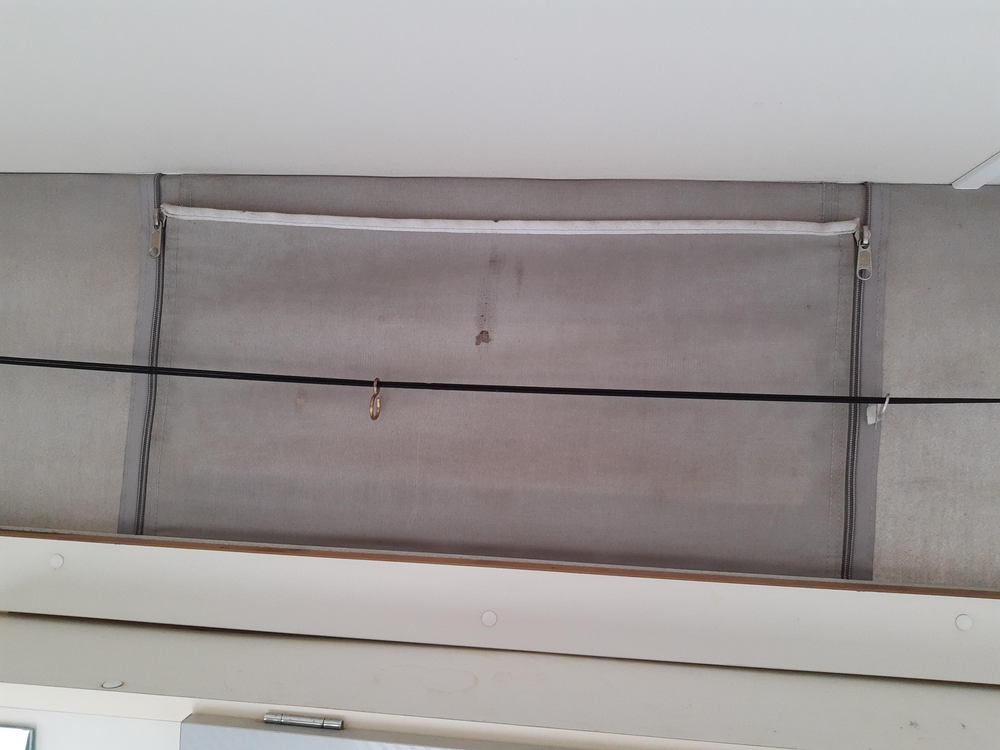
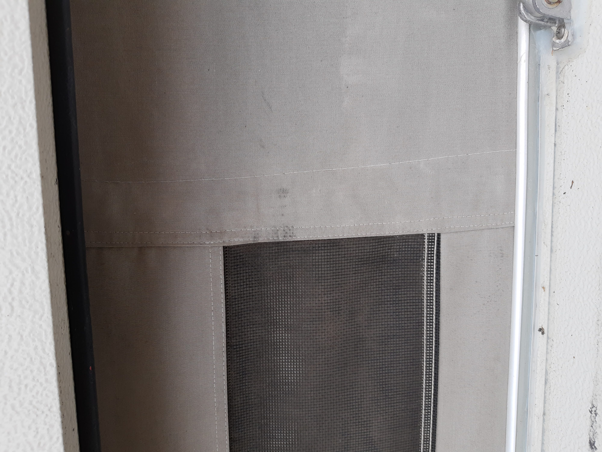

# Kip Kompakt 
## Nieuw hefdak
Onze Kip Caravan heeft een hefdak. Het doek van dit dak is net als de
caravan al meer dan 20 jaar oud. Bij de hoeken zitten gaten van het
opvouwen, en het doek is niet meer waterafstotend. Na enkele lapmiddelen,
zoals opstrijk-doek in de hoeken, en impregneer-spray bleek het dak in een
flinke regenbui op meerdere plaatsen door te lekken. 

OOk is het dak door vorige eigenaren met sileconenkit behandeld. Deze kit
kan niet goed tegen zonlicht, en heeft ook niet goed gehecht aan het dak.

Kortom: **Tijd om het goed aan te pakken. We gaan het dak verwijderen en na
laten maken**. Dat is gelijk een mooi moment om alle kit te verwijderen, en
het dak opnieuw in te kitten met [de juiste soort kit](https://www.obelink.nl/dekalin-dekasyl-ms-2-afdichtingskit.html).

### Voor het verwijderen

Zo zag het dak er uit voordat we het hebben verwijderd.

### Verwijderen van het dak

Eerst verwijder je de inlegbies rondom. Dit is de plastic strip die de
 schroeven afdekt. Deze is niet opnieuw te gebruiken omdat het plastic
uitgehard is.

Daarna verwijder je de schroeven uit het aluminium profiel

Als alle schroeven los zijn kunnen de aluminium afwerkstrips verwijderd
 worden.

Het doek zit vast aan de caravan met 100'en nietjes

